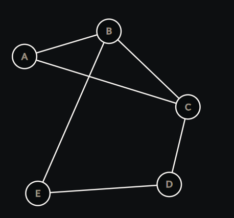

# Graph Theory Playground

## Screenshot


## Table of Contents

- [Description](#description)
- [Installation](#installation)
- [Example Usage](#example-usage)
- [License](#license)

## Description

This repo serves as a testing and playground for concepts in Graph Theory.

I decided to create this repo to help solidify the concepts taught in my discrete mathematics class.

> Note that this library only applies to undirected graphs

This is a work in progress. As I learn more about the theory I will implement more utilities. This is still in development and library functionality hasn't been created just yet. If you wish to play around with the code you can follow the installation steps below:

## Installation

Clone the repository

```shell
git clone https://github.com/iiTONELOC/graph.git
```

Install the dependencies

```shell
cd graph
```

then

```shell
npm i
```

Build the project

```shell
npm run build
```

Run a JavaScript version of the example from below, should log `12` to the console.

```shell
npm run example
```

The library was implemented with a Test Driven Approach and has 100% code coverage. This can be verified by running the `test-cov` script:

```shell
npm run test-cov
```

## Example Usage

Suppose you wanted to know the total degree of the following graph:



```typescript
// Step 1. required imports
import { IVertex, IEdge, Graph, graphUtils, IGraphManipulation } from "./lib";

// Step 2. create an array of objects for the vertices
const vertData: IVertex[] = [
  { id: "1", label: "A" },
  { id: "2", label: "B" },
  { id: "3", label: "C" },
  { id: "4", label: "D" },
  { id: "5", label: "E" },
];

// Step 3. create an array of objects for the edges
const edgeData: IEdge[] = [
  { id: "1", label: "AB", source: vertData[0], target: vertData[1] },
  { id: "2", label: "BC", source: vertData[1], target: vertData[2] },
  { id: "3", label: "AC", source: vertData[0], target: vertData[2] },
  { id: "4", label: "CD", source: vertData[2], target: vertData[3] },
  { id: "5", label: "DE", source: vertData[3], target: vertData[4] },
  { id: "6", label: "EB", source: vertData[4], target: vertData[1] },
];

// Step 4. create the graph utility object
const GraphUtils: IGraphManipulation = graphUtils(
  new Graph(vertData, edgeData)
);

// Step 5. Do stuff!
// get the total degree
const totalDegree = GraphUtils.getTotalDegree();

console.log(totalDegree); // 12
```

[Back To Top](#graph-theory-playground)

## License

This project is licensed with the [MIT License](./LICENSE#the-mit-license-mit)
